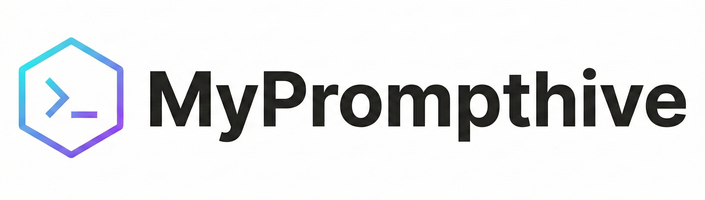
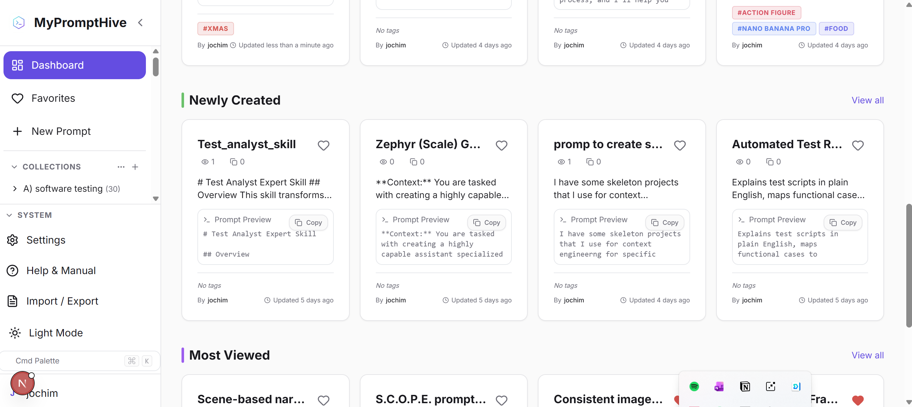

---
title: MyPromptHive - Project README
version: 3.0.0
last_updated: 2026-01-18
---




**MyPromptHive** is a self-hosted, local-first Prompt Management System designed for prompt engineers and AI enthusiasts. It allows you to organize, version, and text your LLM prompts in a beautiful, structured interface.

> 🧪 **Experiment Disclaimer**: This project is an experiment on the limits of "vibe coding". It was **completely vibe coded**, including all documentation, testing, and infrastructure configuration. No manual coding was performed.



## 📜 Changelog

See [CHANGELOG.md](CHANGELOG.md) for the full history of changes.

## 🚀 Comprehensive Feature Overview

### 📝 Core Prompt Management
*   **Rich Editor**: Syntax highlighting for variables and markdown support.
*   **Dynamic Variables**: Define variables like `{{topic}}` or `[[style]]` and auto-generate testing forms.
*   **Version Control**: Automatically track every change.
*   **Visual Diff**: Compare any two versions side-by-side to see exactly what changed (additions/deletions).
*   **Private Prompts**: Mark drafts or sensitive prompts as private so only you can see them.
*   **Metadata**: Add tags, descriptions, source URLs, and attachments to your prompts.

### 🗂️ Organization & Discovery
*   **Nested Collections**: Organize prompts into infinite folders and sub-folders. Supports **Drag & Drop** for easy reorganization.
*   **Advanced Search**: Filter by tags, content, or creator.
*   **Command Palette**: Navigate the entire app without leaving the keyboard (`Cmd+K`).
*   **Workflows (BETA)**: Chain multiple prompts together to create complex automation sequences. *(Note: This feature is currently in BETA and untested)*
*   **Favorites & History**: Quickly access your most used or recently viewed prompts.

### 🔄 Data & Integration
*   **Unified Import**: Seamlessly import data from backups or exports.
*   **AI Web Scraper**: Built-in guide and prompt to let AI agents scrape prompts from any website for you.
*   **Export Options**: Download your entire library as JSON or individual prompts as Markdown.
*   **Automated Backups**: Configure daily, weekly, or monthly automatic backups to a local path.

### ⚙️ System & Administration
*   **Local First**: 100% self-hosted. All data lives in a local SQLite database on your machine.
*   **Internationalization (i18n)**: Fully localized in English, German, French, Spanish, Italian, Dutch, and Swedish.
*   **User Management**: Admin dashboard to manage users and toggle registration.
*   **Customization**: Toggle between Dark and Light modes.
*   **Robust Security**: Local authentication with strictly typed schema validation.

## 🎥 Demos

Demo videos can be found on the following [YouTube Channel](https://www.youtube.com/playlist?list=PLG6RzOn0AXs7ZOoVIXxpU2coTS59sIj_4).


## 🛠️ Technology Stack
*   **Framework**: [Next.js 15+](https://nextjs.org/) (App Router)
*   **Database**: SQLite with [Prisma ORM](https://www.prisma.io/)
*   **Styling**: Tailwind CSS + Custom Design System
*   **Authentication**: NextAuth.js (Local Credentials)
*   **Validation**: Zod schema validation
*   **Testing**: Vitest (Unit) & Playwright (E2E)

## 🏁 Getting Started

### Prerequisites
*   Node.js 18+
*   npm

### Installation

1.  **Clone the repository**
    ```bash
    git clone https://github.com/yourusername/myprompthive.git
    cd myprompthive
    ```

2.  **Install dependencies**
    ```bash
    npm install
    # and
    npm install -g @mermaid-js/mermaid-cli # For doc generation
    ```

3.  **Running the Application**

    This project supports two environments: **Development** and **Production**.

    #### Option A: Development / Test
    *   **Port**: 3000
    *   **Database**: `data/dev.db`
    *   **Use for**: Coding, testing, and debugging.
    *   **Run it this way if you**: Are actively modifying code, debugging new features, or want to see changes update in real-time.
    *   **Pros**: Hot Reloading, Detailed Error Overlays, Easy Debugging.
    *   **Cons**: Slower performance, less strict than production environment.

    ```bash
    # 1. Initialize Database
    npx prisma db push

    # 2. Start Dev Server
    npm run dev
    ```
    Open [http://localhost:3000](http://localhost:3000).

    #### Option B: Production
    *   **Port**: 3100
    *   **Database**: `data/prod.db` (Separate stable database)
    *   **Use for**: Daily usage.
    *   **Run it this way if you**: Want to use the stable application locally with maximum performance and no container overhead, but don't plan to modify the code.
    *   **Pros**: Maximum Performance, Persistent Data (Separate DB), Stable.
    *   **Cons**: No Hot Reloading (requires restart for changes), harder to debug errors.

    ```bash
    # 1. Build the Application
    npm run build

    # 2. Initialize/Update Production Database
    npm run db:push:prod

    # ALTERNATIVE: Start with EMPTY database (Wipes existing data!)
    # npm run db:reset:prod

    # 3. Start Production Server
    npm run start
    ```
    Open [http://localhost:3100](http://localhost:3100).

    #### Option C: Docker (Production)
    Run the production build in an isolated container.

    *   **Run it this way if you**: Want a completely isolated, reproducible environment that mimics a real server deployment, or if you want to run the app in the background without worrying about local Node.js version conflicts.
    *   **Pros**: Complete Isolation, Consistent Environment, Easy Deployment/Migration.
    *   **Cons**: Requires Docker, slightly more complex setup (volume mounting), harder to access internal files directly.

    ```powershell
    # 1. Build the Image
    docker build -t myprompthive-production .

    # 2. Prepare Data Directory
    # Create a 'data' folder in your project root to persist the database.
    # The container will look for /app/data/prod.db
    New-Item -ItemType Directory -Force -Path data

    # 3. Run Container
    # Maps local 'data' folder to container storage
    # Uses docker.env for default configuration (Update this file or use .env.production for real secrets)
    docker run -d -p 3100:3000 --name prompthive `
      -v ${PWD}/data:/app/data `
      -v ${PWD}/public/uploads:/app/public/uploads `
      --env-file docker.env `
      myprompthive-production
    ```
    Open [http://localhost:3100](http://localhost:3100).

### ⚙️ Configuration

The project uses environment variables for configuration.
*   `docker.env`: Included in the repo with default values for easy testing.
*   `.env.production`: (Ignored by Git) Create this file for secure production deployments to override secrets.
*   `admin.properties`: Contains the password to grant yourself admin rights.

**Note on Ignored Files:**
*   `data/*.db`: SQLite databases are ignored to prevent sharing your personal data. They are automatically initialized when you run the setup commands.
*   `public/uploads/*`: User uploads are ignored. The folder structure is preserved.

## 📂 Project Structure

```bash
.
├── actions/              # Modular Server Actions (Prompt, Collection, etc.)
├── app/                  # Next.js App Router (Pages & API)
│   ├── (auth)/           # Login/Register Routes
│   ├── (dashboard)/      # Protected App Routes
│   └── actions.ts        # Facade for Server Actions
├── components/           # React Components
├── docs/                 # Documentation (Single Source of Truth)
│   ├── technical/        # Architecture & Deep Dives
│   └── diagrams/         # Database Models & Diagrams
├── lib/                  # Utilities (Auth, Validation, etc.)
├── prisma/               # Database Schema
├── services/             # Business Logic Layer
└── public/               # Static Assets
```


## 🧪 Testing

Run the test suite (Vitest + Playwright):
```bash
npm run test
```

## 📖 Documentation
For deep dives, check the `docs/` folder:
*   [Technical Architecture](docs/technical/TECHNICAL_REFERENCE.md)
*   [Data Models](docs/diagrams/Data_Models.md)

## 🔗 Links
*   [GitHub Repository](https://github.com/jovd83/prompthive)

## 🗺️ Roadmap

*   [ ] **Storing skills.md entities**: Support for parsing and storing entity definitions from `skills.md` files for better structured data integration.

## Why did I make it?

I built MyPrompthive because I needed a better way to manage my growing collection of prompts. I wanted something that could store prompts efficiently on my own infrastructure, without being locked into any particular AI model or provider. Most existing solutions either lived in the cloud (where I had less control), were tightly coupled to specific APIs, or lacked essential features like proper version history, a flexible folder structure for organization, variable substitution, and attachment support. But equally important was security: I needed a system that could completely decouple prompt management from API credentials. With kids in the house who are naturally curious about AI, I wanted to prevent scenarios where they could accidentally rack up tens of euros in token costs by having access to my API keys. Promthive is that solution: a self-hosted, model-agnostic prompt library that puts organization, security, and cost control first.
