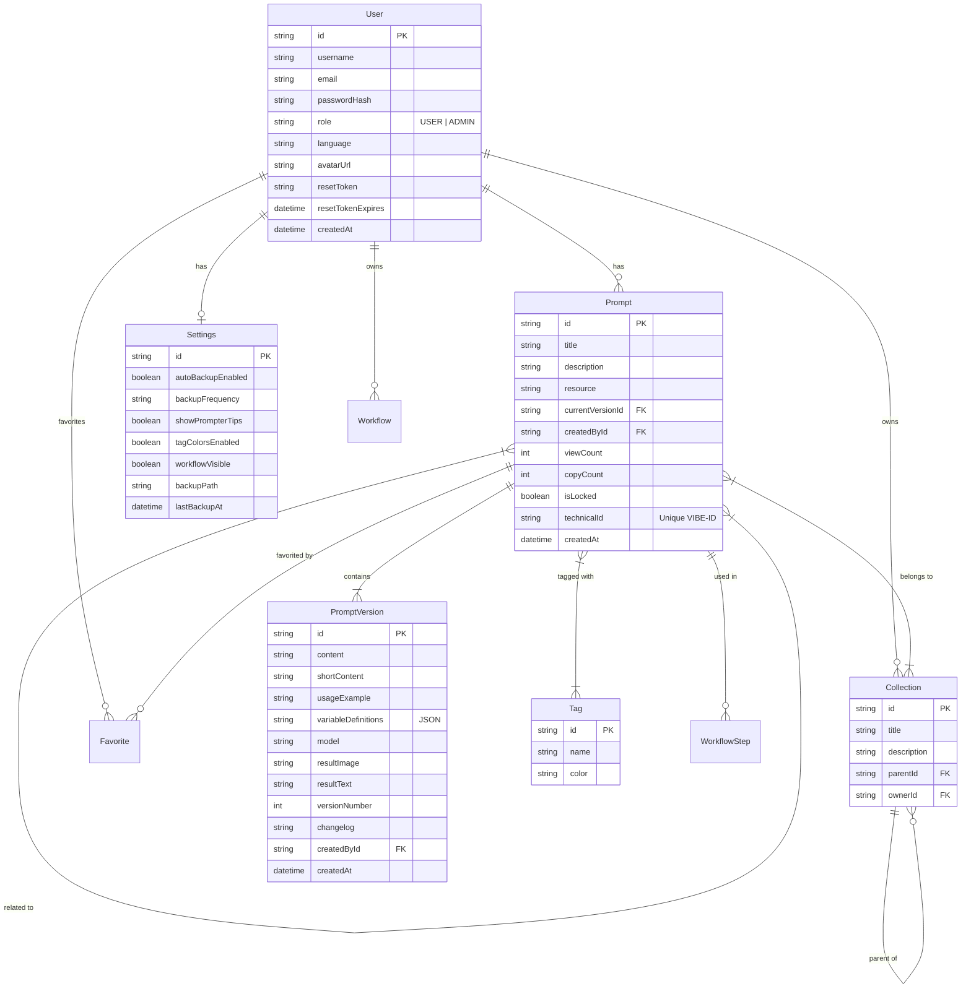

# 🗄️ Data Models & Schema Dictionary

This document serves as the dictionary for the PromptHive local database (SQLite). It matches the definition in `prisma/schema.prisma`.

## Entity-Relationship Diagram

## Model Definitions

### 1. User
Represents a registered user of the system.
*   **Fields**: `id`, `username`, `email`, `passwordHash`, `role`, `language`, `avatarUrl`, `resetToken`, `resetTokenExpires`.
*   **Purpose**: Authentication, profile management, and ownership.

### 2. Prompt & PromptVersion
*   **Prompt**: The central entity. Container for metadata (`title`, `description`, `resource`, `collections`, `tags`).
    *   **New Fields**: `technicalId` (Human-readable ID), `isLocked` (Creator lock).
    *   **Relations**: Contains `relatedPrompts` (Many-to-Many self-relation) to allow linking prompts together.
*   **PromptVersion**: Immutable snapshot of the prompt content.
    *   `content`: The main prompt text.
    *   `shortContent`: Optional concise version.
    *   `variableDefinitions`: JSON string defining inputs.
    *   `changelog`: User notes on what changed.
    *   `attachments`: Related files/images.

### 3. Collection
Folders for organization.
*   **Fields**: `id`, `title`, `description`, `parentId`, `ownerId`.
*   **Behavior**: Hierarchical (Adjacency List). Items can be hidden via Settings.

### 4. Tag
*   **Fields**: `id`, `name`, `color`.
*   **Behavior**: Global tags with optional color customization (hex code).

### 5. Settings
*   **Fields**: `id`, `userId`, `autoBackupEnabled`, `backupPath`, `backupFrequency`, `lastBackupAt`, `showPrompterTips`, `tagColorsEnabled`, `workflowVisible`.
*   **Relations**: `hiddenUsers`, `hiddenCollections` (Many-to-Many visibility toggles).
*   **Purpose**: Stores user-specific configuration, preferences, and admin backup settings.
