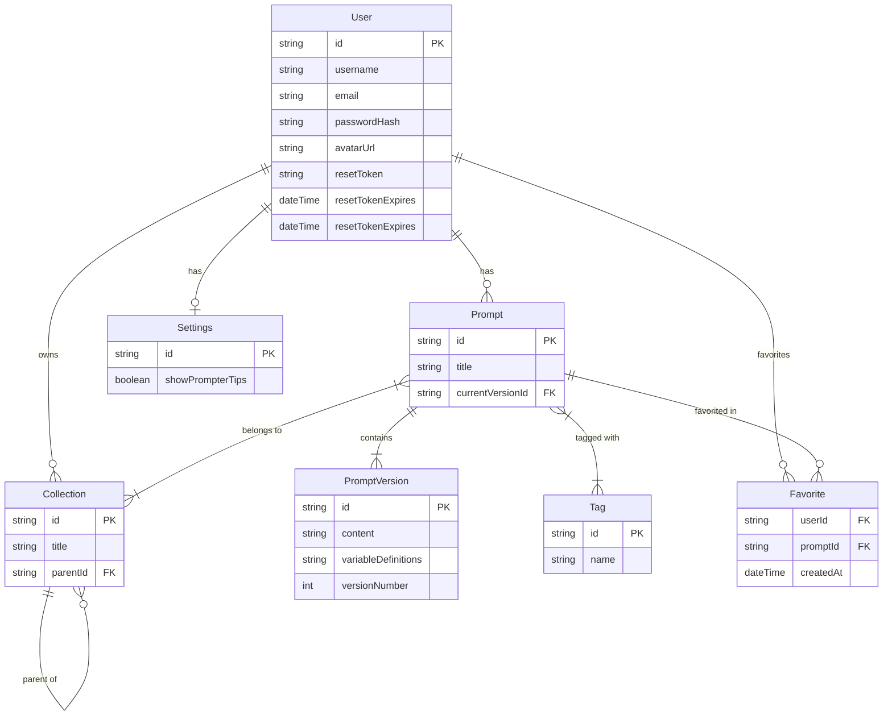

# 🗄️ Data Models & Schema Dictionary

This document serves as the dictionary for the PromptHive local database (SQLite). It matches the definition in `prisma/schema.prisma`.

## Entity-Relationship Diagram

## Model Definitions

### 1. User
Represents a registered user of the system.
*   **Fields**: `id`, `username`, `email`, `passwordHash`, `role`, `avatarUrl`, `resetToken`, `resetTokenExpires`.
*   **Purpose**: Authentication, profile management, and ownership.
*   **Note**: Login handled via username. Password reset supported via token flow.

### 2. Prompt & PromptVersion
*   **Prompt**: The central entity. Container for metadata (`title`, `description`, `collections`, `tags`). Tracks `currentVersionId`.
*   **PromptVersion**: Immutable snapshot of the prompt content.
    *   `content`: The main prompt text.
    *   `longContent`: Optional extended version.
    *   `variableDefinitions`: JSON string defining inputs (e.g., `{{topic}}`).
    *   `changelog`: User notes on what changed in this version.
*   **Versioning Strategy**: Updating a prompt creates a new `PromptVersion` record and updates the `currentVersionId` on the parent `Prompt`. This ensures history is preserved.

### 3. Collection
Folders for organization.
*   **Structure**: Hierarchical (Adjacency List model).
*   **Fields**: `id`, `title`, `parentId`, `ownerId`.
*   **Behavior**:
    *   Collections can contain Prompts and other Collections (children).
    *   Prompts can technically belong to multiple collections (Many-to-Many), though the UI primarily enforces a folder-like structure.
    *   Deletion of a collection usually moves contents to the parent or root.

### 4. Tag
*   **Fields**: `id`, `name`.
*   **Behavior**: Global tags that can be attached to any prompt. Many-to-many relationship.

### 5. Favorite
*   **Fields**: `userId`, `promptId`, `createdAt`.
*   **Purpose**: Allows users to mark prompts for quick access.

### 6. Settings
*   **Fields**: `id`, `userId`, `autoBackupEnabled`, `backupPath`, `backupFrequency`, `showPrompterTips`, `hiddenUsers`, `hiddenCollections`.
*   **Purpose**: Stores user-specific configuration and preferences.
