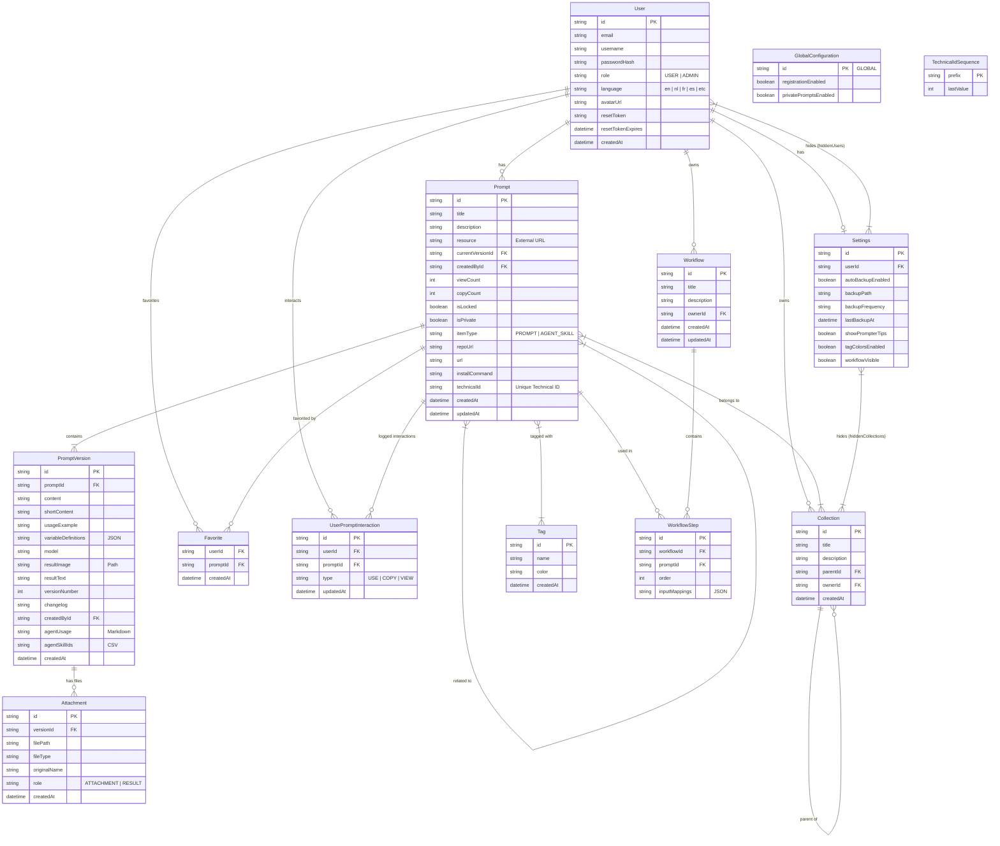

# 🗄️ Data Models & Schema Dictionary

This document serves as the dictionary for the MyPromptHive local database (SQLite). It matches the definition in `prisma/schema.prisma`.

## Entity-Relationship Diagram

```mermaid
erDiagram
    User ||--o{ Prompt : has
    User ||--o{ Collection : owns
    User ||--o| Settings : has
    User ||--o{ Workflow : owns
    User ||--o{ Favorite : "favorites"
    User ||--o{ UserPromptInteraction : "interacts"
    
    User {
        string id PK
        string email
        string username
        string passwordHash
        string role "USER | ADMIN"
        string language "en | nl | fr | es | etc"
        string avatarUrl
        string resetToken
        datetime resetTokenExpires
        datetime createdAt
    }

    Settings {
        string id PK
        string userId FK
        boolean autoBackupEnabled
        string backupPath
        string backupFrequency
        datetime lastBackupAt
        boolean showPrompterTips
        boolean tagColorsEnabled
        boolean workflowVisible
    }
    
    GlobalConfiguration {
        string id PK "GLOBAL"
        boolean registrationEnabled
        boolean privatePromptsEnabled
    }

    Prompt ||--|{ PromptVersion : contains
    Prompt }|--|{ Collection : "belongs to"
    Prompt }|--|{ Tag : "tagged with"
    Prompt ||--o{ WorkflowStep : "used in"
    Prompt ||--o{ Favorite : "favorited by"
    Prompt }|--|{ Prompt : "related to"
    Prompt ||--o{ UserPromptInteraction : "logged interactions"

    Prompt {
        string id PK
        string title
        string description
        string resource "External URL"
        string currentVersionId FK
        string createdById FK
        int viewCount
        int copyCount
        boolean isLocked
        boolean isPrivate
        string itemType "PROMPT | AGENT_SKILL"
        string repoUrl
        string url
        string installCommand
        string technicalId "Unique Technical ID"
        datetime createdAt
        datetime updatedAt
    }

    PromptVersion ||--o{ Attachment : "has files"
    PromptVersion {
        string id PK
        string promptId FK
        string content
        string shortContent
        string usageExample
        string variableDefinitions "JSON"
        string model
        string resultImage "Path"
        string resultText
        int versionNumber
        string changelog
        string createdById FK
        string agentUsage "Markdown"
        string agentSkillIds "CSV"
        datetime createdAt
    }

    Attachment {
        string id PK
        string versionId FK
        string filePath
        string fileType
        string originalName
        string role "ATTACHMENT | RESULT"
        datetime createdAt
    }

    Collection ||--o{ Collection : "parent of"
    Collection {
        string id PK
        string title
        string description
        string parentId FK
        string ownerId FK
        datetime createdAt
    }

    Tag {
        string id PK
        string name
        string color
        datetime createdAt
    }

    Workflow ||--o{ WorkflowStep : contains
    Workflow {
        string id PK
        string title
        string description
        string ownerId FK
        datetime createdAt
        datetime updatedAt
    }

    WorkflowStep {
        string id PK
        string workflowId FK
        string promptId FK
        int order
        string inputMappings "JSON"
    }

    Favorite {
        string userId FK
        string promptId FK
        datetime createdAt
    }

    UserPromptInteraction {
        string id PK
        string userId FK
        string promptId FK
        string type "USE | COPY | VIEW"
        datetime updatedAt
    }

    Settings }|--|{ Collection : "hides (hiddenCollections)"
    Settings }|--|{ User : "hides (hiddenUsers)"
    
    TechnicalIdSequence {
        string prefix PK
        int lastValue
    }
```

## Model Definitions

### 1. User

Represents a registered user of the system.

- **Fields**: `id`, `email`, `username`, `passwordHash`, `role`, `language`, `avatarUrl`, `resetToken`, `resetTokenExpires`.
- **Purpose**: Authentication, profile management, and ownership.

### 2. Prompt & PromptVersion

- **Prompt**: The central entity. Container for metadata (`title`, `description`, `resource`, `collections`, `tags`).
  - **Type Support**: `itemType` allows distinguishing between standard `PROMPT` and `AGENT_SKILL`.
  - **Agent Fields**: `repoUrl`, `url`, `installCommand` support external skill linking.
  - **Technical ID**: Human-readable unique identifier (e.g., `SKILL-001`).
  - **Relations**: Contains `relatedPrompts` (Many-to-Many self-relation) to allow linking prompts together.
- **PromptVersion**: Immutable snapshot of the prompt content.
  - `content`: The main prompt text.
  - `variableDefinitions`: JSON string defining inputs.
  - `agentUsage`: Context-specific usage instructions for AI agents.
  - `agentSkillIds`: References to linked skills for context injection.
  - `attachments`: Related files/images stored via the `Attachment` model.

### 3. Collection

Folders for organization.

- **Fields**: `id`, `title`, `description`, `parentId`, `ownerId`.
- **Behavior**: Hierarchical (Adjacency List). Items can be hidden via Settings.

### 4. Tag

- **Fields**: `id`, `name`, `color`.
- **Behavior**: Global tags with optional color customization (hex code).

### 5. Settings

- **Fields**: `id`, `userId`, `autoBackupEnabled`, `backupPath`, `backupFrequency`, `lastBackupAt`, `showPrompterTips`, `tagColorsEnabled`, `workflowVisible`.
- **Relations**: `hiddenUsers`, `hiddenCollections` (Many-to-Many visibility toggles).
- **Purpose**: Stores user-specific configuration and admin backup settings.

### 6. Interactions & Metrics

- **Favorite**: Junction table for user-bookmarked prompts.
- **UserPromptInteraction**: Tracks recency and frequency of use for sorting and analytics.
- **TechnicalIdSequence**: Manages the auto-incrementing state for technical identifiers.
