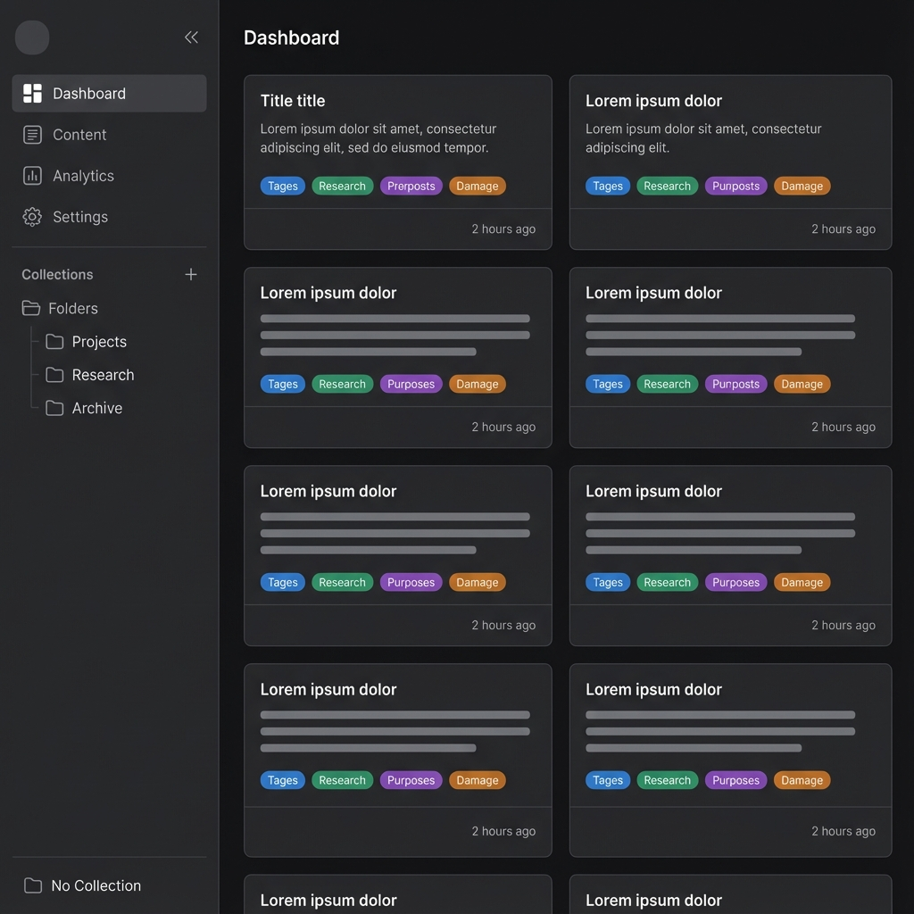

# Epic: Search & Discovery
**Entity:** `Search`, `Dashboard`

This epic focuses on finding content efficiently and surfacing relevant prompts to the user.

## User Stories

### 1. Dashboard Overview
**As a** User
**I want to** see a personalized dashboard when I log in
**So that** I have quick access to my work and popular content.

**UI/UX Description:**
- **Sections:**
    1.  **"Recently used by me"**: Prompts the user interacted with recently (approximated by 'updatedAt' currently).
    2.  **"Newly Created"**: Global feed of latest prompts.
    3.  **"Most Viewed"**: Popular prompts based on view count.
- **Sorting/Filtering:**
    - **Sort Controls:** Dropdown or toggle to sort results by Date, Name, or Popularity.
- **Card Design:** Sleek cards displaying Title, View/Copy counts (Top Right).
    - **Footer content:**
        - **Tags:** Full-width row of semantic colored tag pills (`bg-secondary`, theme-aware).
        - **Timestamp:** "Updated X ago" in a separate row at the bottom-right.
- **Layout:** Grid layout responsive to screen width.

---

### 2. Simple Search
**As a** User
**I want to** search for prompts by keyword
**So that** I can find specific content quickly.

**UI/UX Description:**
- **Interface:** prominent Search Bar at the top of the dashboard/main area.
- **Functionality:** Real-time or "on enter" filtering. Searches against Title, Description, and Tag info.

---

### 3. Advanced Search Filtering
**As a** User
**I want to** filter search results by specific criteria like Tags or Creator
**So that** I can narrow down large result sets.

**UI/UX Description:**
- **Interface:** `AdvancedSearch` component.
- **Interaction:**
    - A toggle button (filter icon) expands an advanced search panel.
    - **Inputs:**
        - `Tags`: Input field (comma separated).
        - `Creator`: Input for username/email.
    - **Results:** The main dashboard view switches from the 3-section layout to a specialized "Search Results" grid when filters are active.
