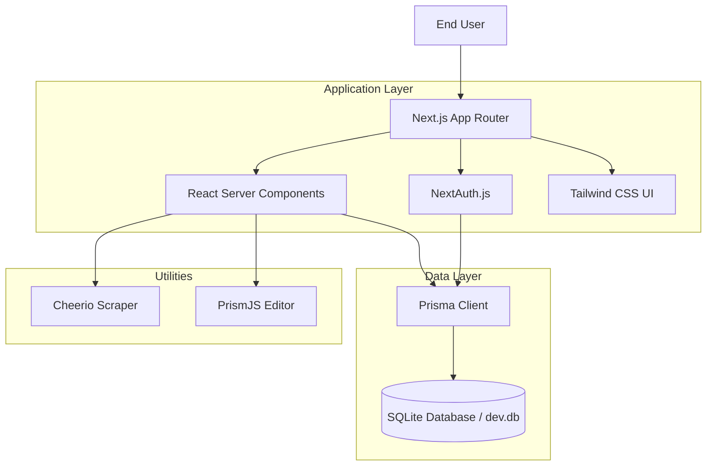

# Software Architecture Document (SAD)
## Technology Stack & Decision Records

This document details the architectural decisions regarding the technology stack chosen for **PromptHive**. It explains the rationale behind each major library and framework, highlighting how they align with the project's core requirements: **Local-First**, **Single-User/Small-Team**, **Privacy-Centric**, and **Rapid Development**.

---

## 1. Core Framework

### **Next.js 15+ (App Router)**
*   **Role:** Full-stack Web Framework (Frontend & Backend).
*   **Decision:**
    *   The project requires a seamless blend of interactive UI (React) and backend logic (Database access, API routes) in a single deployable unit.
    *   **Why Chosen:**
        *   **Server Actions:** Allows calling backend functions directly from frontend components, simplifying data mutation logic without needing a separate API layer (Redux/Rest/GraphQL).
        *   **File-System Routing:** Intuitive directory structure matches the application's information architecture.
        *   **Zero-Config:** Easy to get started and deploy locally.
        *   **React Server Components (RSC):** improved performance by rendering non-interactive parts of the UI on the server, reducing the client-side JavaScript bundle.

## 2. Database & Data Access

### **SQLite**
*   **Role:** Relational Database Engine.
*   **Decision:**
    *   The application is explicitly designed as a "Local-First" tool, similar to a desktop application running in the browser.
    *   **Why Chosen:**
        *   **File-Based:** The entire database resides in a single file (`dev.db`). This makes **Backups** and **Portability** trivial (Copy/Paste the file).
        *   **Zero Infrastructure:** No Docker containers, no PostgreSQL services, no AWS RDS required. It runs wherever Node.js runs.
        *   **Performance:** For single-user or small-team concurrency, SQLite is incredibly fast as reading from disk is direct.

### **Prisma ORM**
*   **Role:** Object-Relational Mapping & Schema Management.
*   **Decision:**
    *   We need Type-Safe database interactions to prevent runtime errors and ensure data integrity.
    *   **Why Chosen:**
        *   **End-to-End Type Safety:** Prisma generates TypeScript types based on the `schema.prisma` file. If the schema changes, the code fails to compile, catching bugs early.
        *   **Migrations:** `prisma migrate` manages the evolution of the SQLite database schema automatically.
        *   **DX (Developer Experience):** The Prisma Studio (`npx prisma studio`) provides a built-in GUI for inspecting and editing data, which is invaluable for debugging local data.

## 3. Authentication & Security

### **NextAuth.js (v4)**
*   **Role:** Authentication Middleware.
*   **Decision:**
    *   Even for a local tool, we want to simulate a multi-user environment (e.g., "Owner" logic) and prepare for potential shared deployment.
    *   **Why Chosen:**
        *   **Standard Solution:** The de-facto standard for Next.js authentication.
        *   **Credentials Provider:** We use the `CredentialsProvider` to authenticate against our local SQLite database (using hashed passwords) rather than forcing social logins.
        *   **Session Management:** Handles JWT encryption and cookie management out of the box.

### **Bcrypt.js**
*   **Role:** Password Hashing.
*   **Decision:**
    *   Passwords must never be stored in plain text, even locally.
    *   **Why Chosen:** Industry standard for salt+hashing passwords. Pure JavaScript implementation ensures compatibility across environments without native bindings issues.

## 4. Frontend & UI UX

### **Tailwind CSS**
*   **Role:** Styling Engine.
*   **Decision:**
    *   Rapid UI development with a consistent design system.
    *   **Why Chosen:**
        *   **Utility-First:** Removes the need for separate `.css` files and class naming conventions (BEM).
        *   **Dark Mode:** Built-in `dark:` variant makes implementing the theme toggle (Sidebar.tsx) seamless.
        *   **Maintainability:** Styles are co-located with HTML structure.

### **Lucide React**
*   **Role:** Iconography.
*   **Decision:**
    *   Need a lightweight, consistent set of icons for the UI.
    *   **Why Chosen:**
        *   **Modern & Clean:** Aesthetically superior to older sets like FontAwesome.
        *   **Tree-Shakeable:** We import only the icons we need (`import { Trash2 } from 'lucide-react'`), keeping bundle size small.

### **React Simple Code Editor + PrismJS**
*   **Role:** Prompt Editor.
*   **Decision:**
    *   The "Prompt Editor" needs syntax highlighting (for variables `{{var}}`) without the massive weight of Monaco (VS Code editor).
    *   **Why Chosen:**
        *   **Lightweight:** A simple textarea overlay.
        *   **Customizable:** We define custom tokenizers to highlight our specific variable syntax in blue/bold.

## 5. Testing Strategy

### **Vitest**
*   **Role:** Unit & Integration Test Runner.
*   **Decision:**
    *   Fast feedback loop for logic tests.
    *   **Why Chosen:**
        *   **Vite-Native:** Faster than Jest as it uses ES modules and Vite's build pipeline.
        *   **Jest Compatible:** Uses familiar `describe`, `it`, `expect` syntax.

### **Playwright**
*   **Role:** End-to-End (E2E) Testing.
*   **Decision:**
    *   Verify the application actually works in a real browser.
    *   **Why Chosen:**
        *   **Reliability:** Auto-waiting mechanism reduces "flaky" tests.
        *   **Traceability:** Records video and traces of test runs for debugging failures.
        *   **Multi-Browser:** Tests Chromium, Firefox, and WebKit capabilities.

## 6. Utilities

*   **Cheerio:** Used in the "Import" feature to scrape generic web pages. Chosen for its speed (parses HTML string without a browser) compared to Puppeteer.
*   **Date-fns:** Utilized for formatting timestamps (e.g., "Last updated 2 days ago"). Chosen for its tree-shakable modularity.

---

## Architecture Summary Diagram

