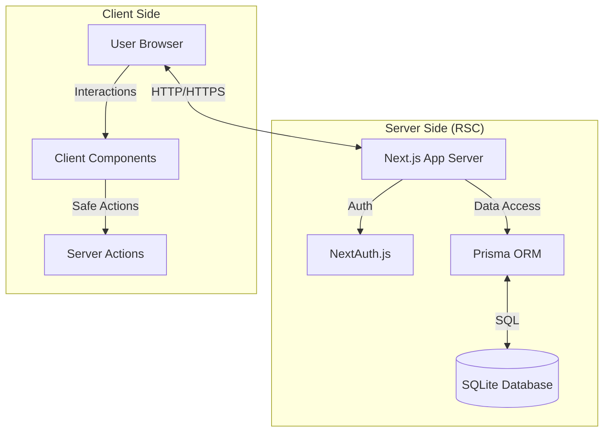
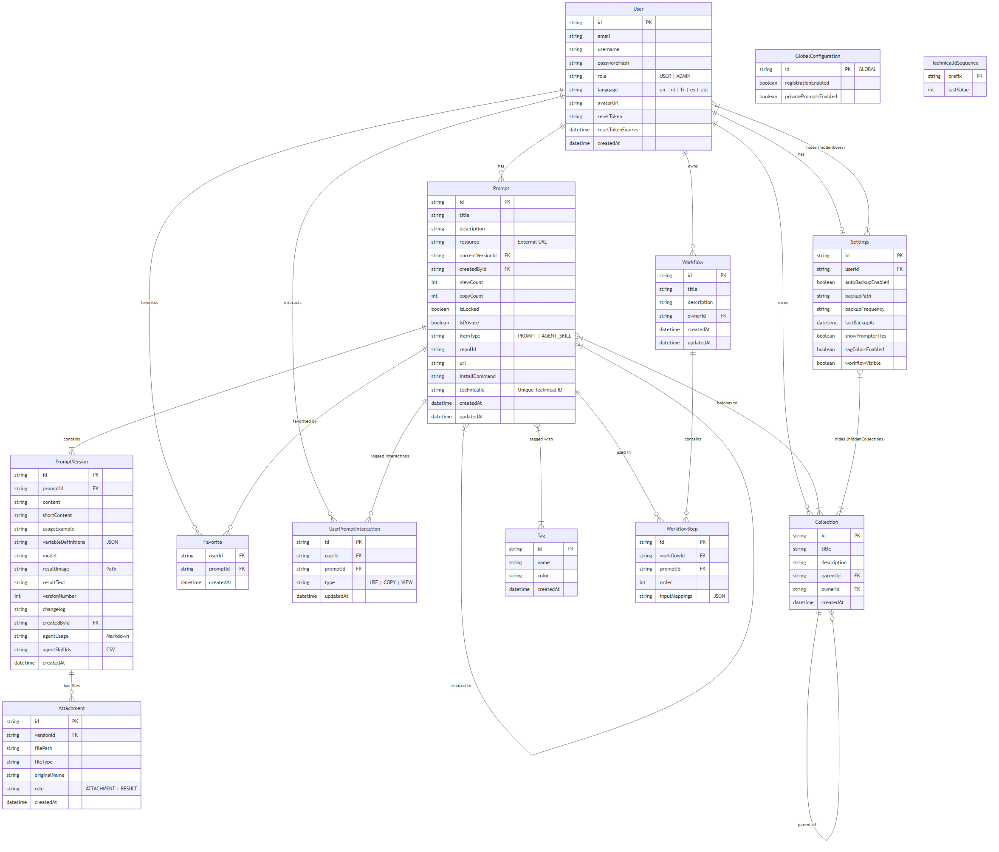
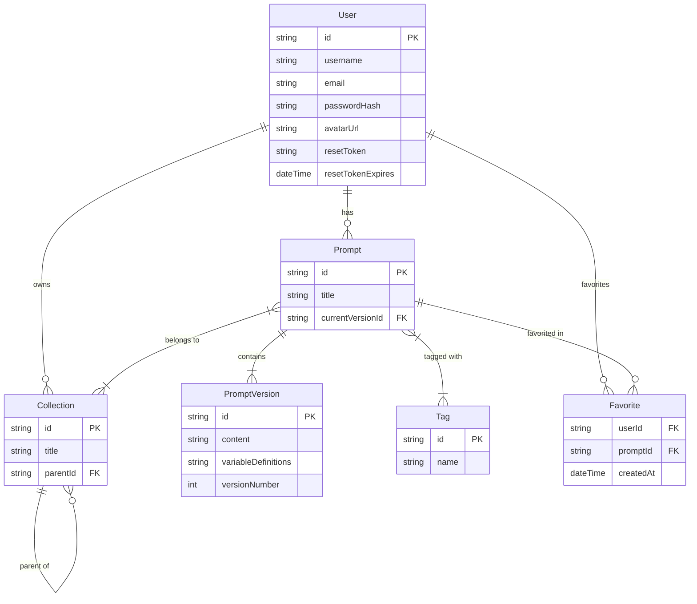
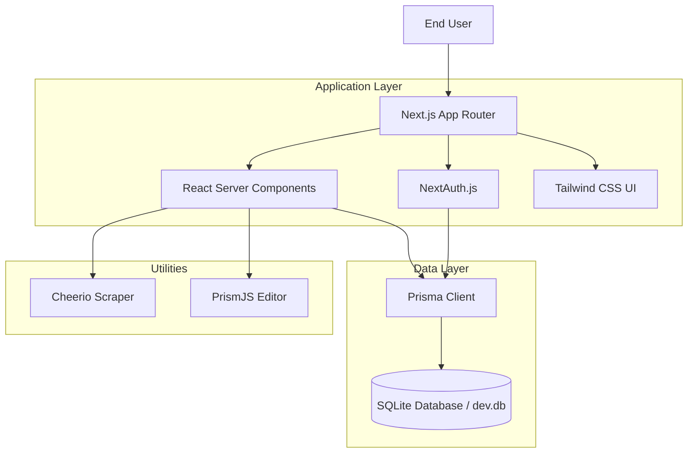

# Technical Reference

This document provides a detailed overview of the PromptHive architecture, data model, and key application logic.

## 🏗️ Architecture Overview

PromptHive is built as a monolithic **Next.js** application using the **App Router** for routing. Following a major refactoring (Dec 2025), the backend logic is now decoupled into modular **Server Actions** and a validation-first **Service Layer**.

Mermaid Source

*   **Frontend**: React Server Components (RSC) are used by default for data fetching. Client Components (`"use client"`) are used for interactive elements.
*   **Backend**: Modular Server Actions located in `actions/` folder (e.g., `actions/prompts.ts`, `actions/collections.ts`).
*   **Database**: SQLite via Prisma ORM.
    *   **Development**: Uses `data/dev.db` (local file).
    *   **Production**: Uses `data/prod.db` (mounted volume in Docker).

### 🛡️ Validation Layer (New)
All user inputs are validated using **Zod** schemas before reaching the business logic.
*   **Location**: `lib/validations.ts`
*   **Strategy**: Strict schema enforcement in Server Actions. Invalid inputs throw structured error messages immediately.

## 🗄️ Database Schema

Mermaid Source

The data model relies on a few core entities:

### 1. User
*   **Fields**: `id`, `username`, `email`, `passwordHash`, `role`, `avatarUrl`, `resetToken`, `resetTokenExpires`.
*   **Purpose**: Authentication, profile management, and ownership.
*   **Note**: Login handled via username. Password reset supported via token flow.

### 2. Prompt & PromptVersion
*   **Prompt**: Container for metadata (`title`, `description`, `collections`, `tags`). Tracks `currentVersionId`.
*   **PromptVersion**: Immutable snapshot of the prompt content.
    *   `content`: The main prompt text.
    *   `shortContent`: Optional short version.
    *   `variableDefinitions`: JSON string defining inputs (e.g., `{{topic}}`).
    *   `changelog`: User notes on what changed in this version.
*   **Versioning Strategy**: Updating a prompt creates a new `PromptVersion` record and updates the `currentVersionId` on the parent `Prompt`.

### 3. Collection (Folders)
*   **Structure**: Hierarchical (Adjacency List model).
*   **Fields**: `id`, `title`, `parentId`, `ownerId`.
*   **Behavior**:
    *   Collections can contain Prompts and other Collections (children).
    *   Prompts can technically belong to multiple collections (Many-to-Many), though the UI primarily enforces a folder-like structure.
    *   Deletion of a collection usually moves contents to the parent or root.

### 4. Tag
*   **Fields**: `id`, `name`.
*   **Behavior**: Global tags that can be attached to any prompt. Many-to-many relationship.

## 📂 Key Components

### `components/TagSelector.tsx`
A fully accessible, keyboard-navigable component for selecting or creating tags.
*   **Features**: Autocomplete, creation on Enter, Arrow key navigation (`ArrowUp`, `ArrowDown`).

### `components/PromptDetail.tsx`
The main view for a prompt. Refactored to be strongly typed and efficient.
*   **Features**: Version history switching, variable filling, copy-to-clipboard (with variable interpolation), recursive breadcrumb navigation.
*   **Safety**: Uses strict types for all props and data.

### `lib/prompt-utils.ts`
Central utility for parsing and handling prompt variables.
*   **Key Function**: `replaceVariables(content, variables)` - Performs the safe interpolation of variable placeholders.
*   **Syntax Support**: Handles both Mustache-style `{{variable}}` and Obsidian-style `[[variable]]` syntax.

### `components/CollectionSplitView.tsx`
A split-pane layout for browsing collections.
*   **Left Pane**: Resizable sidebar tree of sub-collections and list of prompts. Display title and description of the current collection. Supports quick-copy of prompts and inline editing of collection details.
*   **Right Pane**: Detail view of the selected prompt.

### `components/UserProfileDialog.tsx`
A modal dialog for managing user profile settings.
*   **Implementation**: Uses **React Portal** (`createPortal`) to render at the document body level, ensuring correct z-index stacking and backdrop behavior.
*   **Features**:
    *   **Avatar Upload**: Server action-based file upload with immediate UI feedback.
    *   **Security Tab**: Password change functionality using secure server actions.
    *   **Design**: Features a blurred backdrop (`backdrop-blur-md`) and animated transitions for a premium feel.

### `app/(dashboard)/favorites/page.tsx`
Dedicated page for viewing favorite prompts.
*   **Features**:
    *   **Filtering & Sorting**: Supports searching by title/description and sorting by date or alphabetical order (A-Z, Z-A).
    *   **Optimistic UI**: Simple toggle actions update the UI immediately while server actions persist changes in the background.

## 🧩 Recursive Logic

### Recursive Counts
The application computes recursive counts for collections (showing total prompts in a folder *and* its sub-folders).
*   **Implementation**: `lib/collection-utils.ts -> computeRecursiveCounts`
*   **Algorithm**: Fetches all collections for a user, builds an in-memory tree, and performs a post-order traversal to sum up counts.

## 🔐 Authentication & User Management

Authentication is handled by **NextAuth.js** with a custom `CredentialsProvider`.
*   **Strategy**: JWT-based sessions.
*   **Credentials**: Username & Password.
*   **Hashing**: `bcryptjs` is used for password security.
*   **Profile Management**:
    *   **Avatar**: Host-stored images linked via `avatarUrl`.
    *   **Password Reset**: Token-based via email flow.

### Middleware Implementation
The `middleware.ts` file acts as a global route guard using NextAuth.
*   **Matcher**: Protects `/dashboard/:path*` and `/prompts/:path*`.
*   **Logic**: Validates session token. If missing, redirects users to `/login`.

## 📂 File Handling Strategy
File uploads (Avatars, Prompt Images) use a standard `Multipart/Form-Data` flow.
*   **Storage**: Files are saved to the local filesystem (e.g., `public/uploads`).
*   **Database**: We store the *relative path* string (e.g., `/uploads/avatar-123.jpg`) in the database models, never the binary blob itself.
*   **Services**: `services/files.ts` handles the low-level I/O operations (write, delete) to ensure separation of concerns.

## 📦 Import / Export

*   **Format**: JSON.
*   **Compatibility**: Designed to accept exports from PromptCat (generic JSON) and internal backups.
*   **Logic**: `actions/prompts.ts` delegated services handle parsing and re-associating relationships.

## 🚀 Deployment & Infrastructure

### Docker Containerization
The application is fully containerized using a multi-stage `Dockerfile`.

*   **Base Image**: `node:20-alpine` (lightweight linux).
*   **Build Process**:
    1.  Installs dependencies (`npm ci`).
    2.  Generates Prisma Client.
    3.  Builds Next.js app (`npm run build`).
*   **Runtime**:
    *   Runs as non-root user (`nextjs`).
    *   Exposes port `3000`.
    *   Persists data via volume mount at `/app/data`.

### Database Isolation Strategy
To prevent accidental data loss during development, we use strict database isolation:
1.  **Local Development**: Connects to `prisma/dev.db`. This DB can be reset or seeded frequently.
2.  **Production**: Connects to `data/prod.db`. This file maps to a stable volume and should be backed up.
    *   Controlled via `DATABASE_URL` in `.env.production`.

## Technology Stack & Decision Records

This document details the architectural decisions regarding the technology stack chosen for **PromptHive**. It explains the rationale behind each major library and framework, highlighting how they align with the project's core requirements: **Local-First**, **Single-User/Small-Team**, **Privacy-Centric**, and **Rapid Development**.

---

## 1. Core Framework

### **Next.js 15+ (App Router)**
*   **Role:** Full-stack Web Framework (Frontend & Backend).
*   **Decision:**
    *   The project requires a seamless blend of interactive UI (React) and backend logic (Database access, API routes) in a single deployable unit.
    *   **Why Chosen:**
        *   **Server Actions:** Allows calling backend functions directly from frontend components, simplifying data mutation logic without needing a separate API layer (Redux/Rest/GraphQL).
        *   **File-System Routing:** Intuitive directory structure matches the application's information architecture.
        *   **Zero-Config:** Easy to get started and deploy locally.
        *   **React Server Components (RSC):** improved performance by rendering non-interactive parts of the UI on the server, reducing the client-side JavaScript bundle.

## 2. Database & Data Access

### **SQLite**
*   **Role:** Relational Database Engine.
*   **Decision:**
    *   The application is explicitly designed as a "Local-First" tool, similar to a desktop application running in the browser.
    *   **Why Chosen:**
        *   **File-Based:** The entire database resides in a single file (`dev.db`). This makes **Backups** and **Portability** trivial (Copy/Paste the file).
        *   **Zero Infrastructure:** No Docker containers, no PostgreSQL services, no AWS RDS required. It runs wherever Node.js runs.
        *   **Performance:** For single-user or small-team concurrency, SQLite is incredibly fast as reading from disk is direct.

### **Prisma ORM**
*   **Role:** Object-Relational Mapping & Schema Management.
*   **Decision:**
    *   We need Type-Safe database interactions to prevent runtime errors and ensure data integrity.
    *   **Why Chosen:**
        *   **End-to-End Type Safety:** Prisma generates TypeScript types based on the `schema.prisma` file. If the schema changes, the code fails to compile, catching bugs early.
        *   **Migrations:** `prisma migrate` manages the evolution of the SQLite database schema automatically.
        *   **DX (Developer Experience):** The Prisma Studio (`npx prisma studio`) provides a built-in GUI for inspecting and editing data, which is invaluable for debugging local data.

## 3. Authentication & Security

### **NextAuth.js (v4)**
*   **Role:** Authentication Middleware.
*   **Decision:**
    *   Even for a local tool, we want to simulate a multi-user environment (e.g., "Owner" logic) and prepare for potential shared deployment.
    *   **Why Chosen:**
        *   **Standard Solution:** The de-facto standard for Next.js authentication.
        *   **Credentials Provider:** We use the `CredentialsProvider` to authenticate against our local SQLite database (using hashed passwords) rather than forcing social logins.
        *   **Session Management:** Handles JWT encryption and cookie management out of the box.

### **Bcrypt.js**
*   **Role:** Password Hashing.
*   **Decision:**
    *   Passwords must never be stored in plain text, even locally.
    *   **Why Chosen:** Industry standard for salt+hashing passwords. Pure JavaScript implementation ensures compatibility across environments without native bindings issues.

## 4. Frontend & UI UX

### **Tailwind CSS**
*   **Role:** Styling Engine.
*   **Decision:**
    *   Rapid UI development with a consistent design system.
    *   **Why Chosen:**
        *   **Utility-First:** Removes the need for separate `.css` files and class naming conventions (BEM).
        *   **Dark Mode:** Built-in `dark:` variant makes implementing the theme toggle (Sidebar.tsx) seamless.
        *   **Maintainability:** Styles are co-located with HTML structure.

### **Lucide React**
*   **Role:** Iconography.
*   **Decision:**
    *   Need a lightweight, consistent set of icons for the UI.
    *   **Why Chosen:**
        *   **Modern & Clean:** Aesthetically superior to older sets like FontAwesome.
        *   **Tree-Shakeable:** We import only the icons we need (`import { Trash2 } from 'lucide-react'`), keeping bundle size small.

### **React Simple Code Editor + PrismJS**
*   **Role:** Prompt Editor.
*   **Decision:**
    *   The "Prompt Editor" needs syntax highlighting (for variables `{{var}}`) without the massive weight of Monaco (VS Code editor).
    *   **Why Chosen:**
        *   **Lightweight:** A simple textarea overlay.
        *   **Customizable:** We define custom tokenizers to highlight our specific variable syntax in blue/bold.

## 5. Testing Strategy

### **Vitest**
*   **Role:** Unit & Integration Test Runner.
*   **Decision:**
    *   Fast feedback loop for logic tests.
    *   **Why Chosen:**
        *   **Vite-Native:** Faster than Jest as it uses ES modules and Vite's build pipeline.
        *   **Jest Compatible:** Uses familiar `describe`, `it`, `expect` syntax.

### **Playwright**
*   **Role:** End-to-End (E2E) Testing.
*   **Decision:**
    *   Verify the application actually works in a real browser.
    *   **Why Chosen:**
        *   **Reliability:** Auto-waiting mechanism reduces "flaky" tests.
        *   **Traceability:** Records video and traces of test runs for debugging failures.
        *   **Multi-Browser:** Tests Chromium, Firefox, and WebKit capabilities.

## 6. Utilities

*   **Cheerio:** Used in the "Import" feature to scrape generic web pages. Chosen for its speed (parses HTML string without a browser) compared to Puppeteer.
*   **Date-fns:** Utilized for formatting timestamps (e.g., "Last updated 2 days ago"). Chosen for its tree-shakable modularity.

---

## Architecture Summary Diagram

