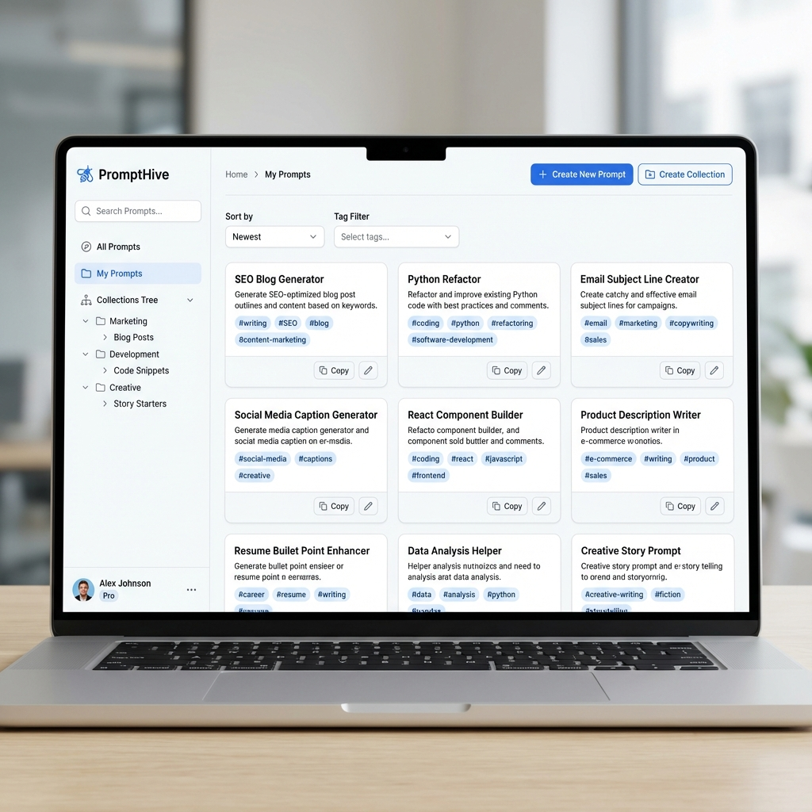
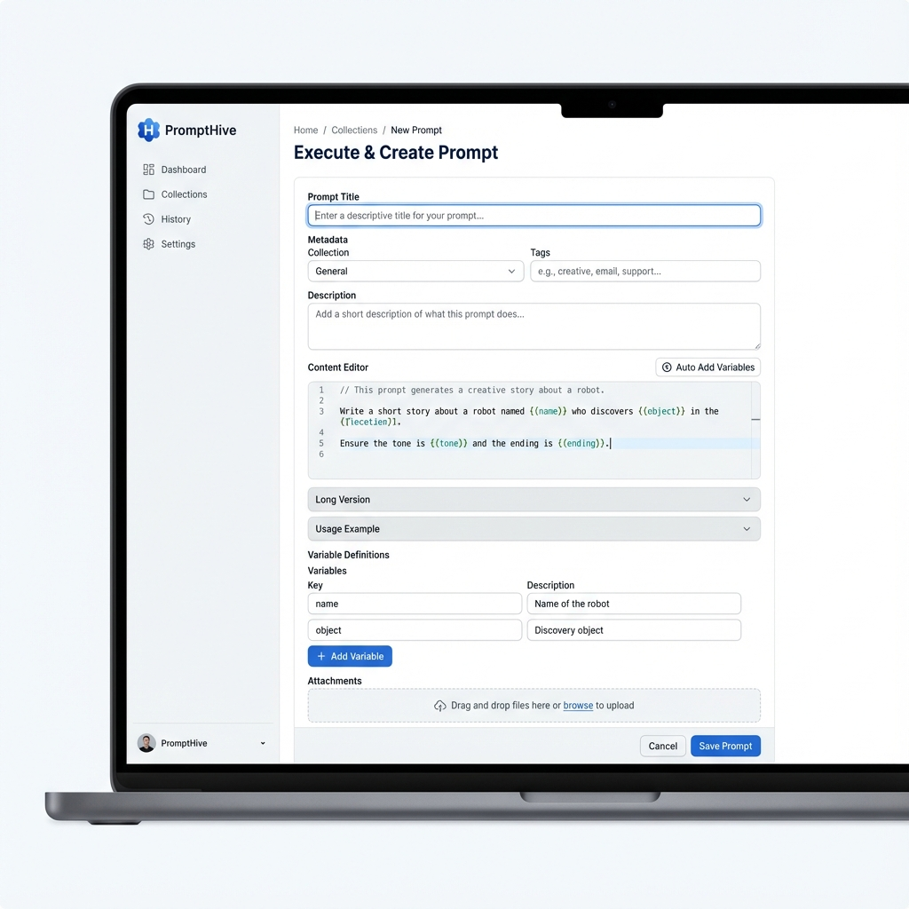
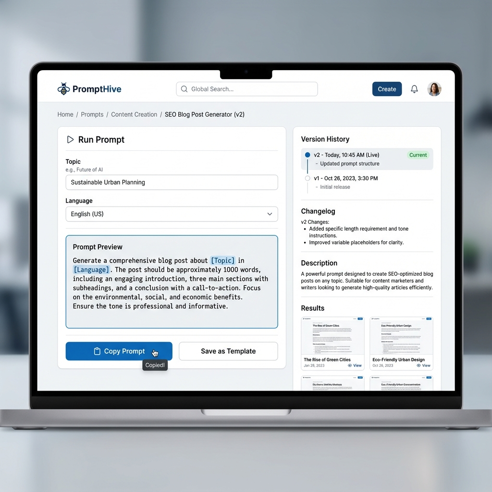
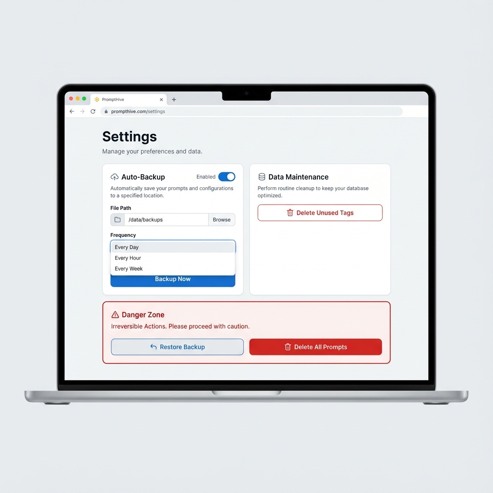
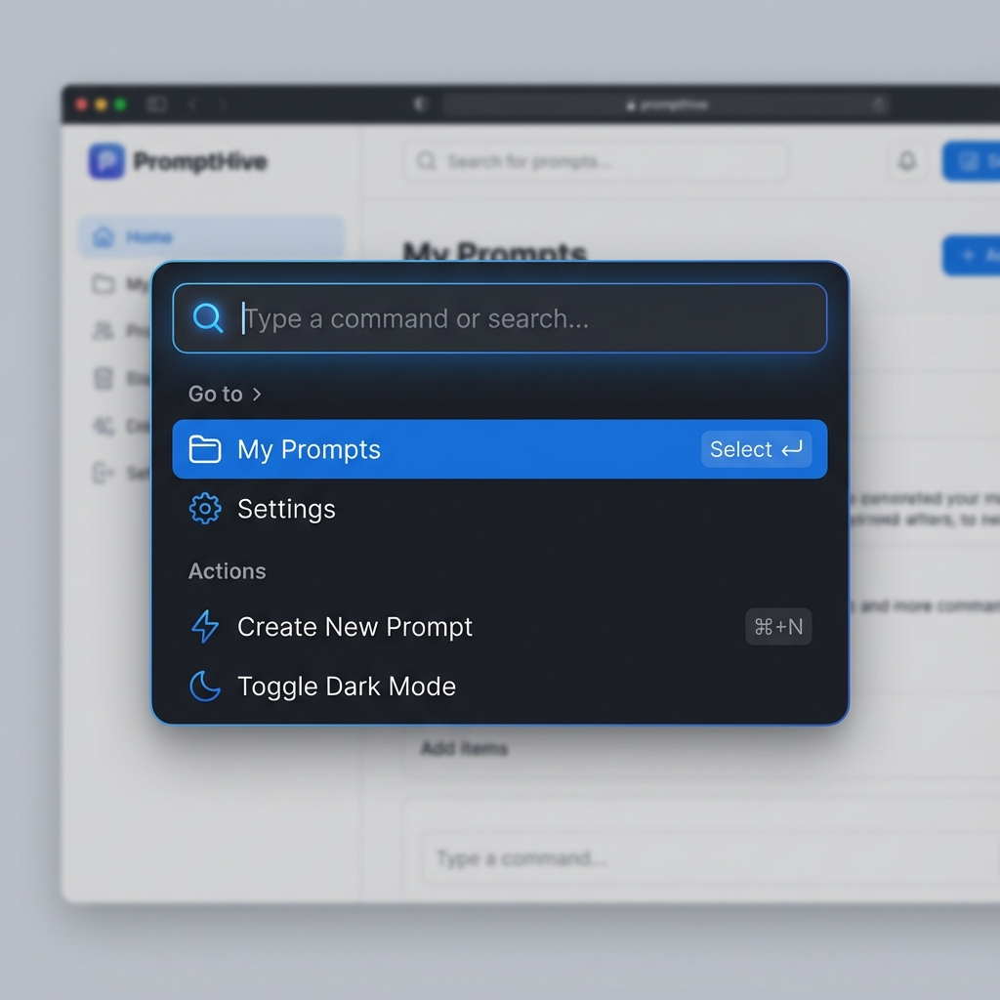
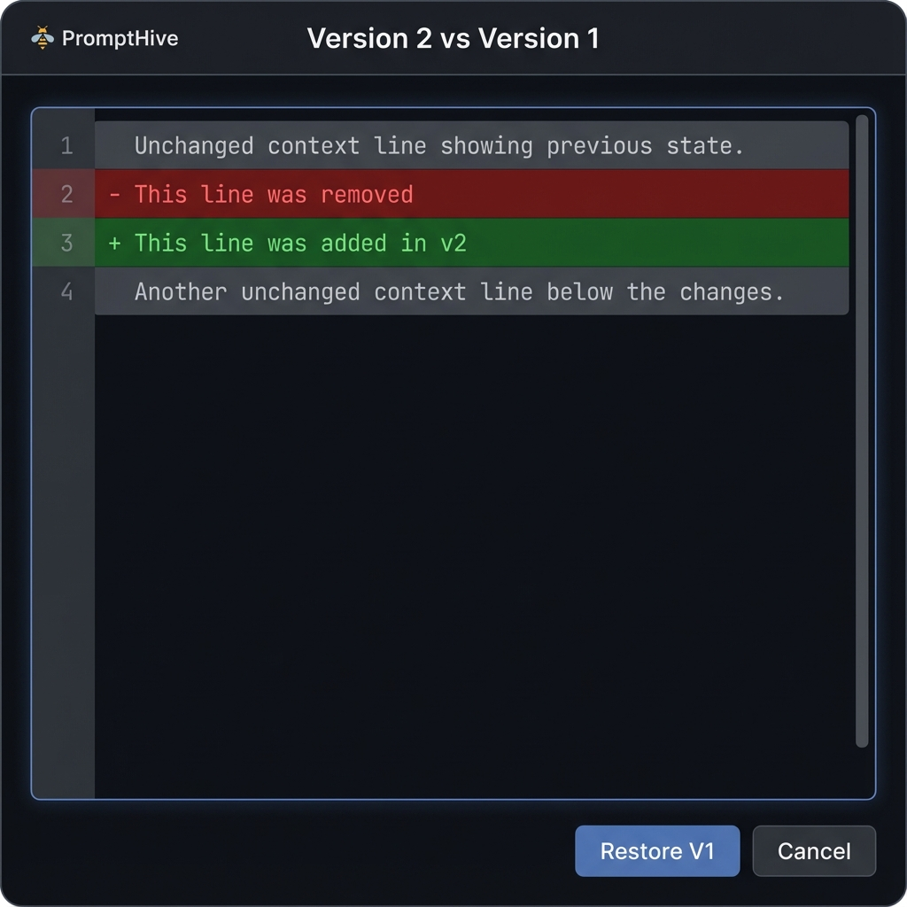

# High-Fidelity UI Previews

This document contains AI-generated high-fidelity mockups of the PromptHive application, based on the wireframe logic and the intended "Clean, Professional SaaS" aesthetic.

## 1. Dashboard
The main command center for managing prompts.

## 2. Editor
The interface for creating and refining prompts.

## 3. Prompt Detail
The view for running, testing, and managing a specific prompt.

## 4. Settings
Configuration for backups and data management.

## 5. Command Palette (`Cmd+K`)
Quick navigation and action execution.

## 6. Visual Diff
Comparing different versions of a prompt.

## 7. Prompt Chaining
Advanced workflow editor for connecting multiple prompts.

