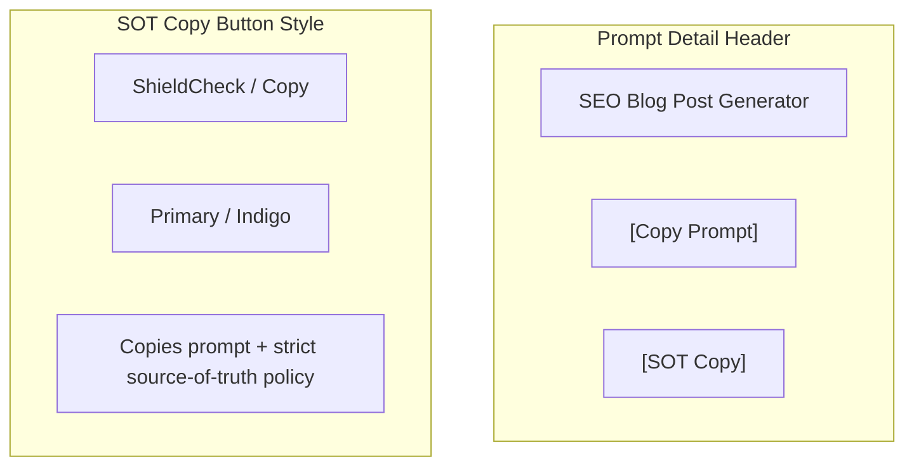

> [!WARNING]
> This wireframe is DEPRECATED. The standalone "Copy with SOT Policy" button has been replaced by the [Advanced Copy Feature](./WF-018_AdvancedCopy.md).

# Wireframe: Source-of-Truth Copy Action

## 1. Objective
Add a specialized "Copy with SOT Policy" action to the Prompt Detail view. This action allows users to copy the prompt content along with a standardized "STRICT SOURCE-OF-TRUTH POLICY" block to ensure better compliance when using the prompt with other AI agents.

## 2. UI Layout (Prompt Detail Header)

The action is placed next to the existing "Copy Prompt" button in the `PromptContent` component.



## 3. Interaction Flow

1.  **User Navigates** to a Prompt Detail page.
2.  **User Fills** variables (optional).
3.  **User Clicks** "Copy with SOT Policy".
4.  **System Replaces** variables in the prompt content.
5.  **System Appends** the SOT Policy block:
    ```
    [Prompt Content]

    ---
    STRICT SOURCE-OF-TRUTH POLICY
    [Policy Text...]
    ```
6.  **System Shows** success toast: "Copied with Policy!".
7.  **System Logs** `copy_with_sot` event to analytics.

## 4. Visual Preview (Mockup)

```text
+-------------------------------------------------------------+
| [📝] SEO Blog Post Generator                 [Standard Copy] |
|                                       [Copy with SOT Policy] |
+-------------------------------------------------------------+
| DESCRIPTION                                                 |
| This prompt generates high-quality SEO optimized blog posts. |
+-------------------------------------------------------------+
| PROMPT CONTENT                                     [Code View] |
| +---------------------------------------------------------+ |
| | You are an expert copywriter...                         | |
| | Subject: {{topic}}                                      | |
| | ...                                                     | |
| +---------------------------------------------------------+ |
+-------------------------------------------------------------+
```

## 5. Acceptance Criteria
- Button is clearly visible and labeled.
- Distinguishable from standard copy button.
- Appends correct policy text.
- Variable replacement is honored.
