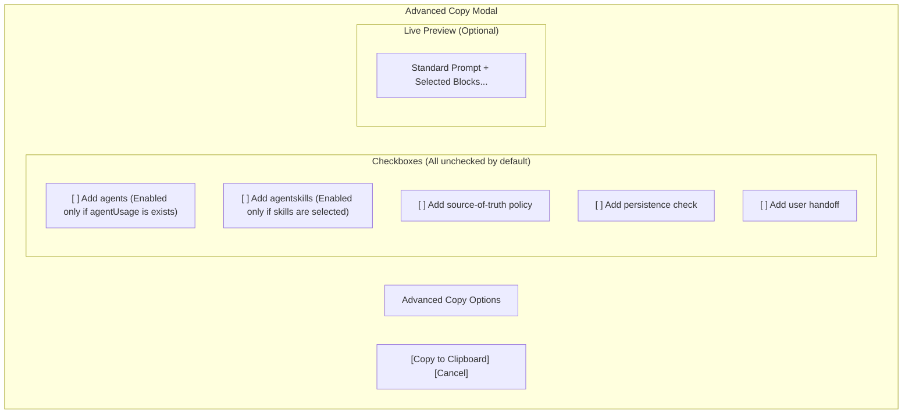

# Wireframe: Advanced Copy Features

## 1. Objective
Replace the static "Copy with SOT Policy" button and the automatic inclusion of agents/agentskills in the standard copy with a flexible "Advanced Copy" modal or section. This allows users to selectively append additional context, policies, and handoff instructions.

## 2. UI Layout (Advanced Copy Modal)

The advanced copy interface is triggered from the Prompt Detail view (e.g., via a "..." menu next to the standard Copy button or an "Advanced Copy" link).



## 3. Placement in Prompt Detail

```text
+-------------------------------------------------------------+
| [📝] SEO Blog Post Generator                                |
| [Copy] [Advanced Copy ▾] [Download] [Edit] [Delete] [❤️]     |
+-------------------------------------------------------------+
|                                                             |
| ... Prompt Content ...                                      |
|                                                             |
+-----------+-------------------------------------------------+
            | ADVANCED COPY MENU                              |
            | [ ] Add agents                                  |
            | [ ] Add agentskills                             |
            | [x] Add source-of-truth policy                  |
            | [ ] Add persistence check                       |
            | [ ] Add user handoff                            |
            |                                                 |
            | [Copy Selected]                                 |
            +-------------------------------------------------+
```

## 4. Interaction Rules
1.  **Refactor**: The main **[Copy]** button now copies *only* the prompt content with variables replaced.
2.  **Toggle Availability**:
    *   `Add agents` is disabled if `selectedVersion.agentUsage` is null/empty.
    *   `Add agentskills` is disabled if `selectedAgentSkills` array is empty.
3.  **Persistence**: Checkbox states are NOT persisted; they reset to FALSE on every page load/open.
4.  **SOT Policy**: Uses the new version of the Source-of-Truth policy text.

## 5. Acceptance Criteria
- [ ] No more "Copy with SOT Policy" standalone button.
- [ ] No agents/agentskills in the standard copy.
- [ ] Advanced Copy allows granular selection.
- [ ] Disabled states for data-dependent options work correctly.
- [ ] Correct policy text is used for each option.
